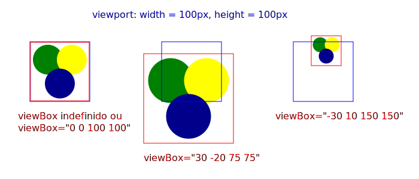

# SVG - Scalable Vector Graphics

## Índice

1. [Sintaxe](#sintaxe)
2. [Tips](#tips)


<a id="#sintaxe"></a>

---

## Sintaxe

```html

<svg></svg>

```

<a id="#tips"></a>

---

## Tips

- Gera a tela, o canvas, a área de renderização do SVG e nela gera o viewport (área visível);
- Parafraseando a [Sara Soueidan](http://www.sarasoueidan.com/), wizard SVG level 100,  super-referência em SVG:

  >"*The __viewport__ is the viewing area where the SVG will be visible. You can think of the __viewport__ as a window through which you can see a particular scene. The scene may be entirely or partially visible through that window.*"

    ou seja: "**O _viewport_ é a área de visualização onde o SVG será visível. Você pode pensar no viewport como uma janela através de onde você pode ver uma cena particular. A cena pode ser inteira ou parcialmente visível através desta janela.**";
- Para **_width_** e **_height_** a unidade padrão é o pixel (**_px_**), porém podemos utilizar também as unidades: **_em, ex, px, pt, pc, cm, mm, in, e %_**;
- Ao carregar o SVG, os navegadores estabelecem um valor inicial para **ambos** os seus sistemas de coordenadas:
  - **_viewport coordinate system_** (coordenadas do *viewport*): Plano Cartesiano (eixo **_x,y_**) inicial, com a interseção de seus eixos (seu ponto 0,0) no canto esquerdo superior do elemento `<svg></svg>`;
  - **_user coordinate system_** (coordenadas do *viewbox*): Plano Cartesiano (eixo **_x,y_**) que inicialmente tem o sua interseção de eixos igual ao do cartesiano do *viewport*, canto esquerdo superior do elemento `<svg></svg>`, porém pode ser alterado via o atributo `viewBox` desta tag;

---

## Atributos

- **width**: largura do *viewport*;
- **height**: altura do *viewport*;
- **viewBox**: sistema de coordenadas de usuário **(_user coordinate system_)**. [Mais detalhes abaixo](#viewboxDetails);
- **preserveAspectRatio**: uilizado para manter uniforme e preservando as proporções do redimensionamento do grupo de vetores. [Mais detalhes abaixo](#preservAspectRatioDetails);

<a id="#viewboxDetails"></a>

---

## `viewBox` - O manipulador de visualização

### Sintaxe

```html
  <svg viewBox="x y w h"></svg>
```

Onde:

- **x** :  Altera a posição horizontal da interseção de eixos do *viewBox* estará dentro do *viewport*;
- **y** : Altera a posição vertical da interseção de eixos do *viewBox* estará dentro do *viewport*;
- **w** : Altera a largura de todo o conjunto de elementos visíveis dentro do *viewport*;
- **h** : Altera a altura de todo o conjunto de elementos visíveis dentro do *viewport*;

### Tips

- O *viewBox* funciona como se fosse a tela inteira, o canvas inteiro, da imagem, fazendo do *viewport* uma espécie de "janela" que se move pela tela e ao se redimensionar, aplica zoom na mesma. (Assim como o navegador se comporta em relação ao mapa no Google Maps, sendo o mapa o canvas inteiro e o navegador somente o viewport).

### Exemplo

